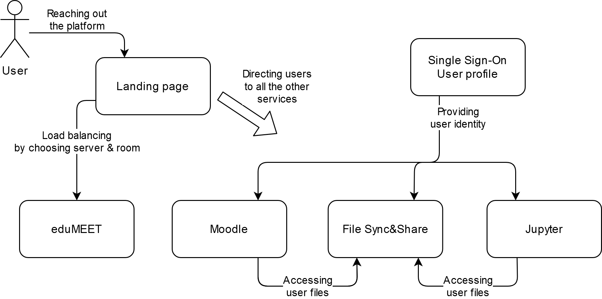

# Architecture

This part describes the logical (functional) architecture
of main software components of the Up2U platform as well as
the characteristics of the necessary underlying infrastructure.

## Logical software architecture

|  |
| --- |

The figure above presents the overview of the main software components and their functions. 

The landing page is the entry point to the platform,
through which users are directed to other components.
The landing page can be realised as a static web page with relevant links
(see [example](https://up2university.eu/up2universe/)).
Creation of the landing page is not covered in these Guidelines.
Other components are discussed in the following parts.

The main software components are:

- LMS - Moodle - a course management system based on a free open-source software
designed to help educators create effective online courses.
- VC - eduMEET - an open-source web-based video-conferencing platform
developed in the GÉANT (GN4-3) Project that provides a self-hosted,
secure and trustworthy environment for distance learning.
- File Sync&Share - a software service that enable users to securely
synchronize and exchange documents, photos, and other files.
- Jupyter - a software service for interactive computing and rich notebook editing.
- SSO - a software service that enable users to use a single identity (user account)
across different services.

Two different implementations are further discussed
for each of File Sync&Share, Jupyter, and SSO. 

## Underlying infrastructure

The adopted software services can be deployed in various ways.
The following approaches have been selected for Up2U services.
Deployment details are discussed separately for service further in these Guidelines.

Some services (File Sync&Share, Jupyter, and SSO) are run in
[Docker containers](https://en.wikipedia.org/wiki/Docker_(software))
within [Kubernetes](https://en.wikipedia.org/wiki/Kubernetes).
Some services are deployed in Kubernetes using [Helm](https://helm.sh/).

Other services (Moodle, eduMEET) are deployed in bare
[virtual machines](https://en.wikipedia.org/wiki/Virtual_machine).
Some deployment steps are automated with [Ansible](https://www.ansible.com/). 

It is assumed that the readers are familiar with these technologies.
