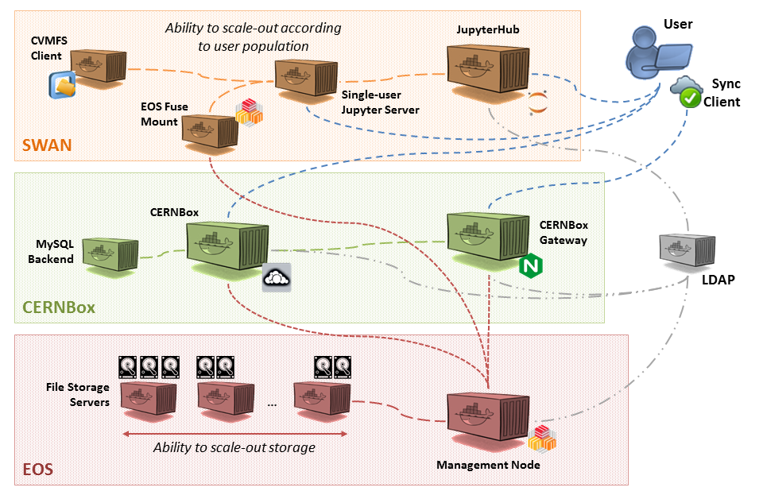

# CERNBox

CERNBox is a file sync&share solution used at CERN.

Find more information in [the official website](https://cernbox.web.cern.ch/cernbox/about/).

## Software Architecture

The architecture of CERNBox, [SWAN](jupyter_swan.md),
and the underlying [EOS](https://eos-web.web.cern.ch/) storage solution
presents the following diagram:

|  |
| --- |
| Source: [github.com/sciencebox/kuboxed](https://github.com/sciencebox/kuboxed) |

&nbsp;

## Deployment

In Up2U, it is deployed in a Kubernetes (K8s) cluster,
by applying provided definitions (templates) of K8s objects.
These definitions as well as step by step deployment instructions
are available [here](https://github.com/sciencebox/kuboxed).

In brief, the deployment consists of the following stages:

1. Preparing the cluster and labelling its nodes for specific purposes
1. Preparing persistent storage spaces
1. Deploying the LDAP service for managing user accounts,
using template `LDAP.yaml`
1. Deploying the EOS storage service,
using templates `eos-*.yaml`
1. Deploying the actual CERNBox service,
using template `CERNBox.yaml`

## Integration with SSO

Example configuration for integrating with SSO via SAML
is available [here](https://github.com/up2university/CERNBox-customizations).

Such a configuration can be provided to `CERNBox.yaml`
by setting the following environmental variables for
the `cernbox` container within the `cernbox` K8s deployment:  

```
- name: CUSTOMIZATION_REPO
  value: "https://github.com/up2university/CERNBox-customizations.git"
- name: CUSTOMIZATION_COMMIT
  value: "master"
- name: CUSTOMIZATION_SCRIPT
  value: ""
```
